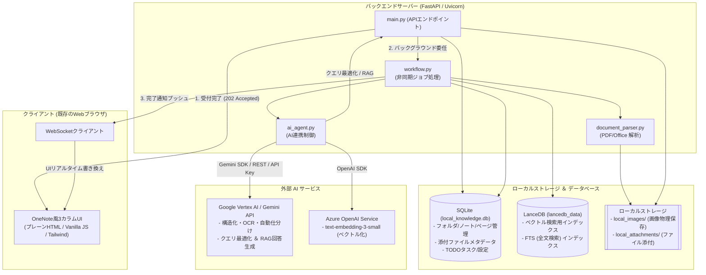
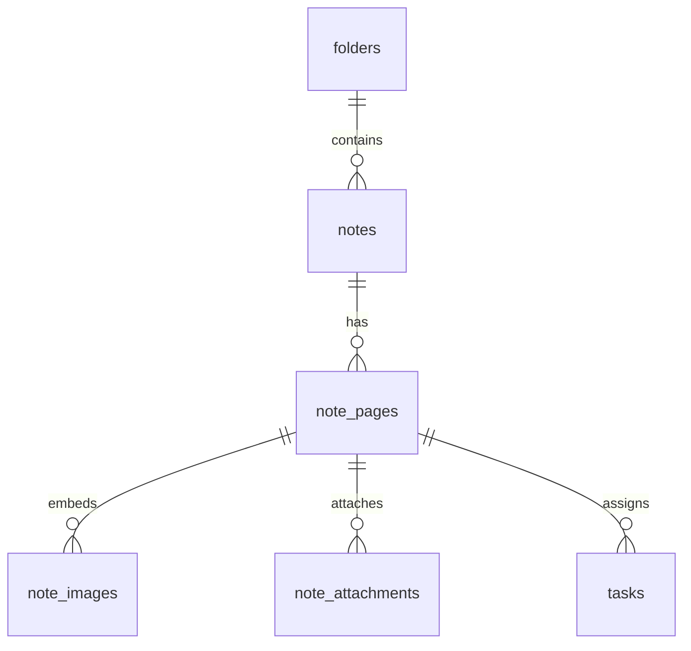

# AI Native Local Knowledge Database

本システムは、個人の機密情報および組織の内部情報を安全に扱うための、**完全ローカル（オンプレミス）運用のAIネイティブなナレッジデータベース**です。

従来のメモ帳やナレッジ管理ツールにおける画像・ドキュメント管理の煩雑さやAI機能の不足を解決し、**「ユーザーはテキストや画像、ファイルを雑に放り込むだけで、裏でAIが勝手に要約・自動仕分け・ベクトル化を行う」**究極 of ノンブロッキング知的生産環境を提供します。

---

## 🚀 主な機能

1. **インボックス（雑多収集 ✕ ノンブロッキング設計）**
   - 収集用の画面を開いて、テキスト入力や画像のドラッグ＆ドロップ、クリップボードからの画像ペースト（Ctrl + V、および「スクショ貼り付け」ボタン）を雑に連続で行うことができます。
   - バックグラウンドの非同期ジョブキュー（FastAPI `BackgroundTasks`）に重いAI処理を委譲することで、UIは一瞬もフリーズせず、次の入力を即座に行えます。

2. **複数ページ（タブ切り替え）管理機能 🌟**
   - OneNote風に、1つのノートの中に複数の「ページ」を作成し、タブで切り替えて管理・編集できます。
   - タブの切り替え時や画像・ファイルの追加・削除時には、バックグラウンドでサイレント自動保存が走り、未保存データの消失を防ぎます。

3. **マルチ画像 ＆ 一般ファイル添付・AI解析機能 🌟**
   - 1つのページに対して、**複数の画像**や**一般ドキュメントファイル**（PDF, Word, Excel, PowerPoint, Text, Markdown）を紐づけて管理できます。
   - 添付されたファイルはバックグラウンドでテキスト解析され、AIによる内容の要約・タグの生成が行われるため、RAG（意味検索）のソースとして即座に検索可能になります。
   - 解析結果（OCRテキストやAI要約）は、詳細画面の「AI解析」タブや添付ファイルカードからいつでも確認可能です。

4. **ドキュメント・インポート機能 🌟**
   - PDF, PPTX, DOCX, XLSX, TXT, MDファイルそのものをノートとしてインポートできます。
   - インポートされたファイルは、各スライドやページ単位で個別のページタブとしてSQLite/LanceDB上に自動展開されます。
   - スライド画像の一括エクスポート（WindowsのPowerPoint COM連携による高品質エクスポート、または python-pptx による抽出）や、各ページのテキスト抽出・Geminiによる自動要約・タグ生成・LanceDBへのハイブリッド検索インデックス構築がバックグラウンドで並行処理されます。

5. **バックグラウンド非同期構造化 ＆ OCR**
   - Gemini 3.5 を使用し、Pydantic モデルを用いた **Structured Outputs（構造化出力）** によって、入力されたデータから「生OCRテキスト」「3行要約」「関連タグ」「分類先フォルダID」「自信度（Confidence Score）」を正確なJSON形式で抽出します。
   - 追加・削除された画像や添付ファイルの中身は自動的に再解析され、要約・タグ・タイトル・ベクトルが再計算されます。

6. **自動仕分け ＆ インコンテキスト学習 (フィードバック学習)**
   - AIが提示した分類自信度が閾値（デフォルト：0.7）を下回る場合、またはどのフォルダにも合致しない場合は、勝手に移動せず「📥 仮置き（自動整理）（`inbox`）」としてユーザーに判断を委ねます。
   - ユーザーが手動でフォルダを修正した際、その判断事実と理由を Gemini に渡し、自動仕分けガイドライン（`rules.md`）へ追記・更新させます。これにより、使えば使うほど自動仕分けの精度が向上します。

7. **ハイブリッド検索 ＆ ローカルRAG基盤（二段階フィルタリング）**
   - **二段階フィルタリングの導入**: ベクトルDB類似度による足切り（粗フィルタ）と、LLMによる文脈的関連性判定（密フィルタ）を組み合わせ、ハルシネーションを極限まで低減します。
   - **ベクトル検索（意味検索）**: AI要約＋タグから生成された1536次元のベクトル空間から、意味の近いページを LanceDB の近傍検索（ANN）で高速抽出します。
   - **キーワード検索（全文検索）**: 全画像のOCRテキストおよび添付ファイル抽出テキストに対し、LanceDBのFTS（Full-Text Search）を利用し、キーワード完全一致でヒットさせます。
   - **ローカルRAG**: ヒットした上位数件のコンテキストを Gemini に流し込み、過去のナレッジを100%の根拠とした「調査レポート」を生成します。

8. **リアルタイムUI同期 (WebSocket) ＆ エディタ保護**
   - バックグラウンドでの構造化・自動仕分け・ドキュメントインポート・添付ファイル解析が完了した瞬間、WebSocket を通じて画面にプッシュ通知を送信し、画面がリアルタイムで更新されます。
   - **エディタ上書き保護**: メモ編集中のデータ消失を防ぐため、エディタフォーカス中や未保存変更がある場合はエディタの強制上書きをスキップし、メタデータや添付ファイルリストのみを部分更新（Partial Update）します。

9. **ダークモード ＆ AIパラメータ設定機能**
   - OneNote風の3カラムUIは、ライト/ダークテーマの切り替えに対応しています。
   - 設定画面から「AIモデル」「推論レベル（`thinking_level`）」「自動仕分け自信度閾値」「RAG参照件数」「RAG足切り閾値」を動的に変更し、SQLiteに保存・反映できます。

---

## 📐 システムアーキテクチャ

システム全体の処理フローとモジュール構成は以下の通りです。



---

## 🛠 技術スタック

- **UIフロントエンド**: プレーン HTML / Vanilla JS / Tailwind CSS (CDN)
- **バックエンド**: Python 3.11+ / FastAPI / Uvicorn / aiofiles
- **リレーショナルDB**: SQLite (階層・メタデータ・複数画像・複数ページ・添付ファイル・タスク管理用)
- **ベクトルDB**: LanceDB (列指向・ディスクファースト・超低メモリ消費・OSの `mmap` 利用)
- **ドキュメント解析ライブラリ**:
  - **PDF**: `pypdf`, `pypdfium2` (レンダリング・OCR用)
  - **PowerPoint**: `python-pptx`, `win32com` (Windows PowerPoint COM連携による高品質画像化)
  - **Word**: `python-docx`
  - **Excel**: `pandas`, `openpyxl`, `tabulate` (Markdownテーブルへの変換)
- **利用AI**:
  - **画像解析・構造化・仕分け・RAG**: Gemini 3.5 (Flash / Pro) via `google-genai` SDK
    - *フォールバック仕様*: Vertex AI SDK (サービスアカウントJSON) ➔ Google AI Studio REST API (OAuth2) ➔ APIキー (`GEMINI_API_KEY`) の順に自動フォールバック接続を試行。
  - **ベクトル化 (Embedding)**: Azure OpenAI `text-embedding-3-small` (1536次元)

---

## 📂 ディレクトリ構成

```text
local-knowledge-db/
│
├── env/                    # APIキーおよびサービスアカウントキー配置先 (Git管理外)
│   ├── azure.env           # Azure OpenAI 接続設定 (APIキー、エンドポイント)
│   └── gemini.json         # Vertex AI サービスアカウントキー (GCPプロジェクト情報)
│
├── local_images/           # ユーザーが添付した画像の物理保存先 (Git管理外)
├── local_attachments/      # ユーザーが添付した一般ファイルの物理保存先 (Git管理外)
├── temp_import/            # ファイルインポート時の一時展開先
├── lancedb_data/           # LanceDB ベクトルデータ保存先 (Git管理外)
├── local_knowledge.db      # SQLite データベースファイル (Git管理外)
├── rules.md                # AIが学習・更新する自動仕分けルールファイル
│
├── requirements.txt        # 依存ライブラリ一覧
├── main.py                 # FastAPI エントリポイント・WebSocket管理・API定義
├── config.py               # 環境変数・物理パス・API設定読み込み
│
├── database/               # データベース制御レイア
│   ├── sqlite_client.py    # 階層・メタデータ・画像・添付ファイルテーブル管理 (SQLite)
│   └── lance_client.py     # ベクトル・FTS検索管理 (LanceDB)
│
├── services/               # AI・ビジネスロジックレイア
│   ├── ai_agent.py         # Gemini / Azure OpenAI 外部API連携 (認証フォールバック)
│   ├── workflow.py         # 非同期ワークフロー (仕分け・学習・同期・再解析・インポート)
│   └── document_parser.py  # 各種一般ファイルのテキスト・画像抽出パーサー
│
├── templates/
│   └── index.html          # OneNote風3カラムUI
│
├── start.bat               # Windows用 サーバー起動バッチ (ポート8080)
└── stop.bat                # Windows用 サーバー停止バッチ (ポート8080のプロセス終了)
```

---

## 💾 データベース構造とマイグレーション

複数ページ構成およびファイル添付のサポートに伴い、SQLite データベースのスキーマは以下のように設計されています。

### 1. テーブル階層構造
ノートは「フォルダ ➔ ノート ➔ ページ ➔ 画像 / 添付ファイル / タスク」の 1:N 関係で管理されます。



- **`folders`**: フォルダの階層管理（初期状態では `inbox` が `📥 仮置き（自動整理）` として登録されます）。
- **`notes`**: ノート本体の基本メタデータ。
- **`note_pages`**: 各ノートが内包する複数のページ。本文 (`raw_text`)、AI要約 (`ai_summary`)、AIタグ (`ai_tags`)、およびOCRテキスト (`ai_ocr_text`) はページ単位で保持されます。
- **`note_images`**: ページに紐づく画像リストと個別の画像OCRテキスト。
- **`note_attachments`**: ページに紐づく添付ファイル（PDF, Word, Excel, PPTX等）のメタデータとAI解析結果。
- **`tasks`**: ページに紐づくTODOタスク。
- **`settings`**: AIやUIの各種パラメータ設定。

### 2. 自動マイグレーション機能
データベース接続初期化時 (`sqlite_client.init_db()`) に、`PRAGMA user_version` を利用した段階的マイグレーションが自動実行されます。旧バージョン（シングル画像仕様、シングルページ仕様など）のデータベースが存在する場合でも、データ損失なしで最新のバージョン 6 スキーマへと安全にアップデートされます。

---

## 📡 主要APIエンドポイント

### 1. フォルダ・ノート操作
- `GET /api/folders`: フォルダ一覧取得
- `POST /api/folders`: フォルダ新規作成
- `PUT /api/folders/{folder_id}`: フォルダ名変更
- `DELETE /api/folders/{folder_id}`: フォルダ削除 (退避 / 一括物理削除の選択可)
- `POST /api/folders/{folder_id}/notes`: フォルダ内へのノート手動新規作成
- `GET /api/folders/{folder_id}/notes`: 指定フォルダのノート一覧取得
- `GET /api/notes/{note_id}`: ノート詳細（全ページ・画像・添付ファイルリスト）の取得
- `PUT /api/notes/{note_id}`: ノート手動編集
- `DELETE /api/notes/{note_id}`: ノート物理削除 (SQLite, LanceDB, 画像/添付ファイルの物理削除)
- `POST /api/notes/import`: ドキュメントインポート (PDF, Word, Excel, PPTX 等のファイルをノートとしてインポートして自動ページ展開)

### 2. ページ・画像・添付ファイル操作
- `POST /api/notes/{note_id}/pages`: ノートへの新規ページ追加
- `PUT /api/notes/{note_id}/pages/{page_id}`: ページ情報の更新 (手動編集・ベクトル再計算)
- `DELETE /api/notes/{note_id}/pages/{page_id}`: ページの削除 (画像・添付ファイル、ベクトルの物理削除)
- `PUT /api/notes/{note_id}/pages/reorder`: ページのソート順序変更
- `POST /api/notes/{note_id}/pages/{page_id}/image`: ページへの画像追加添付 (OCR・再解析)
- `DELETE /api/notes/{note_id}/pages/{page_id}/images/{image_id}`: ページ内画像の削除 (再解析)
- `POST /api/notes/{note_id}/pages/{page_id}/attachments`: ページへの一般ファイル添付 (非同期AI解析・ベクトル登録)
- `GET /api/attachments/{attachment_id}`: 添付ファイルのダウンロード
- `DELETE /api/attachments/{attachment_id}`: 添付ファイルの削除 (再計算)

### 3. 検索・RAG ＆ 設定
- `GET /api/search?q={query}`: ハイブリッド検索 (クエリ最適化 ➔ ベクトル ✕ FTS全文検索) ＆ ローカルRAG回答生成
- `POST /api/fix-folder`: 手動仕分け修正 ＆ インコンテキスト学習による `rules.md` の更新
- `GET /api/settings`: 現在のAI・UI設定一覧の取得
- `POST /api/settings`: 設定の更新（SQLiteへの保存・即時反映）

---

## ⚙️ セットアップ ＆ 起動手順

### 1. 仮想環境の構築と依存パッケージのインストール
Python 3.11以上がインストールされていることを確認してください。

```bash
# 仮想環境の作成
python -m venv env

# 仮想環境の有効化 (Windows)
call env\Scripts\activate

# 依存パッケージのインストール
pip install -r requirements.txt
```

### 2. 環境変数の設定 (APIキーの配置)
APIキーは直接コードに書かず、`env/` ディレクトリ配下に作成・配置します。

#### A. Azure OpenAI の設定 (ベクトル化用)
`env/azure.env` という名前のファイルを新規作成し、以下の形式でキーとエンドポイントを記述します。
```ini
AZURE_OPENAI_API_KEY="あなたのAzure OpenAI APIキー"
AZURE_OPENAI_ENDPOINT="https://あなたのエンドポイント名.openai.azure.com/"
```

#### B. Gemini / Google Vertex AI の設定 (構造化・OCR・仕分け・RAG用)
Google Cloud の Vertex AI または Google AI Studio を利用できます。以下のいずれかの方法で認証を設定します。

- **サービスアカウントキーの利用 (推奨)**:
  Google Cloud Console からダウンロードしたサービスアカウントの秘密鍵 JSON ファイルを、`env/gemini.json` として配置します。
- **通常の API キーの利用**:
  システム環境変数 `GEMINI_API_KEY` に Google AI Studio の API キーを設定します。

> [!NOTE]
> **APIキーが未設定の場合の動作について**
> APIキーのロードに失敗した場合や、オフライン環境の場合、システムは自動的に「モックフォールバックモード」で動作します。モックテキスト応答やダミーベクトルを生成するため、APIキーを設定しなくても基本的なUI動作や動作確認が可能です。

### 3. アプリケーションの起動

#### Windows環境の場合
ルートディレクトリにある `start.bat` をダブルクリックする、またはコマンドプロンプトから実行します。
```cmd
start.bat
```
自動的に既定のブラウザで `http://localhost:8080` が開き、バックエンドサーバーが起動します。

#### 手動で起動する場合
仮想環境を有効化した状態で、以下のコマンドを実行します。
```bash
uvicorn main:app --host 127.0.0.1 --port 8080 --reload
```
起動後、ブラウザで `http://localhost:8080` にアクセスしてください。

### 4. アプリケーションの停止

#### Windows環境の場合
`stop.bat` をダブルクリック、または実行することで、ポート8080を使用しているUvicornプロセスを安全に強制終了させます。
```cmd
stop.bat
```

---

## 🔒 セキュリティと機密性

- **データのポータビリティ**: データベースファイル (`local_knowledge.db`)、画像・添付フォルダ (`local_images/`, `local_attachments/`)、仕分けルール (`rules.md`) をコピーするだけで、他環境へのバックアップや移行が完全に実行可能です。ベンダーロックインはありません。
- **完全ローカル運用**: AI API を呼び出すHTTPS通信を除き、外部へのテレメトリ（利用ログ等の送信）は一切行われません。社外秘データやプライベートなナレッジも安心して蓄積できます。

---

## 📄 ライセンス

本プロジェクトは [Apache2.0](LICENSE) の下で公開されています。
